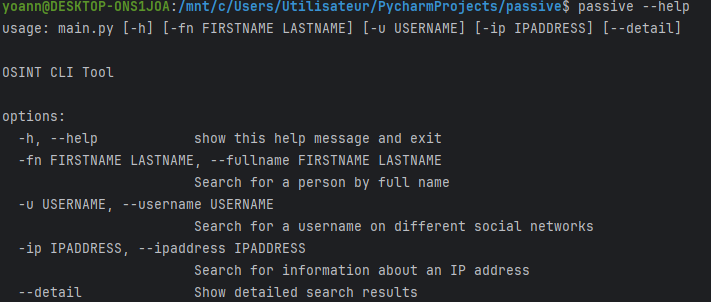
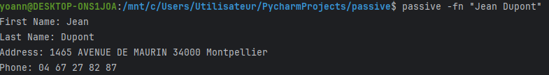
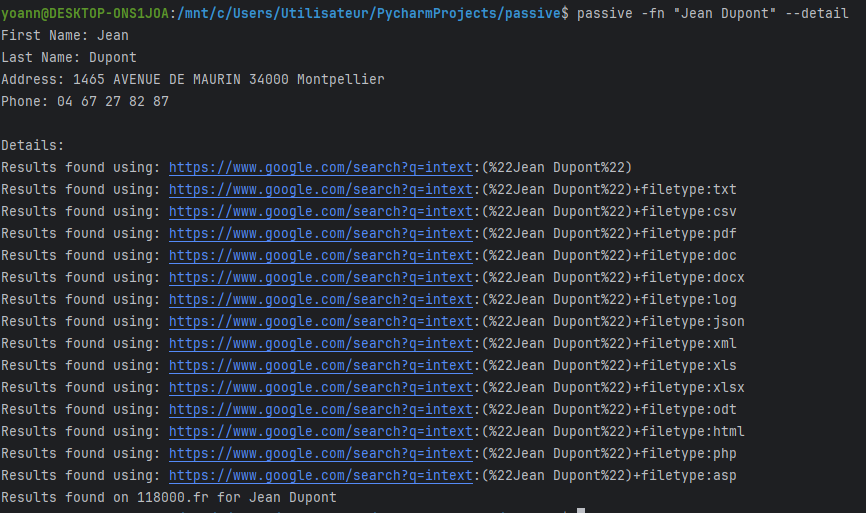
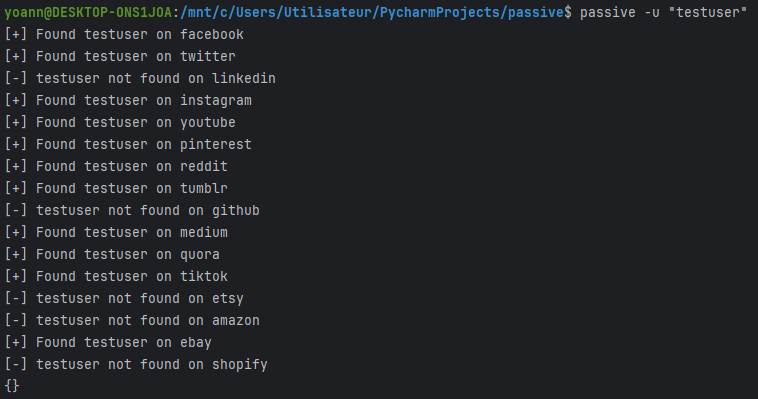
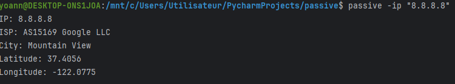

# Passive OSINT CLI Tool

Passive OSINT CLI Tool is a command-line interface (CLI) tool designed to perform passive Open Source Intelligence (OSINT) operations. It allows you to search for information about people, usernames, and IP addresses using various sources and techniques.
The tool is written in Python and uses the `requests` library to make HTTP requests to the target websites.
The full name search implement a dorking technique to search for the target name in the target website.
## Installation

### Prerequisites

- Python 3.6 or higher
- `pip3` (Python package installer)
- `make` (build automation tool)

### Installing `make`

If you don't have `make` installed, you can install it using the following commands:

#### On Ubuntu/Debian:
```sh
sudo apt update
sudo apt install make
```

#### On Windows:
You can install make by installing the [Chocolatey](https://chocolatey.org/) package manager and running the following command:
```sh
choco install make
```
Or using Git Bash or MinGW.


### Installing the tool

1. Clone the repository:
```sh
git clone https://github.com/YoannLetacq/basic-osint-tool.git #github

https://zone01normandie.org/git/yyoannle/passive.git #zone01
cd passive
```
2. Install the required Python packages:
```sh
pip3 install -r requirements.txt
``` 
3. Install the CLI tool:
```sh
make install
```

## Usage

### Commands 

* `passive --help`: Show the help message.
* `passive -fn <FIRSTNAME> <LASTNAME>`: Search for a person by full name.
* `passive -fn <FIRSTNAME> <LASTNAME> --detail`: Search for a person by full name and show detailed search results.
* `passive -u <USERNAME>`: Search for a username on different social networks.
* `passive -ip <IPADDRESS>`: Search for information about an IP address.

## Examples

1. Show help message:
```sh
passive --help
```



2. Search for a person by full name:
```sh
passive -fn "Jean Dupont"
```



3. Search for a person by full name and show detailed search results:
```sh
passive -fn "Jean Dupont" --detail
```



4. Search for a username on different social networks:
```sh
passive -u "testuser"
```


5. Search for information about an IP address:
```sh
passive -ip "8.8.8.8"
```



## Running with Hardcoded parameters

If you prefer not to install the CLI tool or encounter issues, you can run the functions directly with hardcoded parameters.

1. Open `main.py` and locate the `run_tests` function.

2. Modify the parameters as needed and run the script directly:
```python
from cli.cli_process import main_cli
from osint.full_name_search import search_full_name
from osint.username_search import search_username
from osint.search_ip import search_ip

def run_tests():
    print("Running tests with hardcoded parameters...\n")

    print("Testing full name search:")
    full_name_result = search_full_name("John", "Doe", show_details=True)
    print(full_name_result)
    print("\n")

    print("Testing username search:")
    username_result = search_username("testuser")
    print(username_result)
    print("\n")

    print("Testing IP search:")
    ip_result = search_ip("8.8.8.8")
    print(ip_result)
    print("\n")

if __name__ == "__main__":
    import sys
    if len(sys.argv) > 1 and sys.argv[1] == "--test":
        run_tests()
    else:
        main_cli()
```
3. Run the script with the `--test` argument:
```sh
   python main.py --test
   ```

## Directory Structure

The project directory structure is as follows:

```plaintext
osint/
    __init__.py
    full_name_search.py
    username_search.py
    ip_search.py
    user_agents.py
    dork.txt
    sites.json
cli/
    __init__.py
    cli_process.py
tests/
    __init__.py
    test_full_name_search.py
    test_username_search.py
    test_ip_search.py
main.py
Makefile
README.md
requirements.txt
```

## Development

### Running Tests

To run the tests, you can use the following command:

```sh
python3 -m unittest discover tests
```

## License

This project is licensed under the MIT License. See the [LICENSE](LICENSE) file for more information.

## Contributing

Contributions are welcome! Please open an issue or submit a pull request if you have any improvements or bug fixes.

## Acknowledgements

Special thanks to all the contributors and the OSINT community for their valuable resources and tools.

### `requirements.txt`
```shell
### `requirements.txt`
requests~=2.31.0
beautifulsoup4~=4.12.3

```
## Author

Yoann Letacq 

Special thanks to Diet Maxime for his precious advice and support.